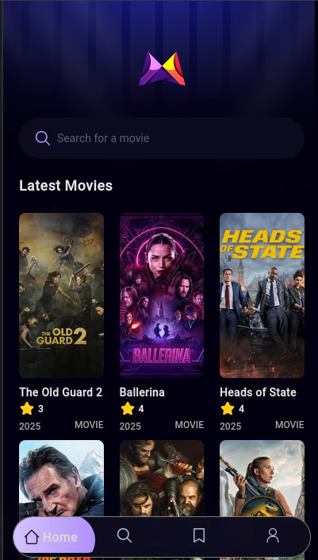

# React Native Movie App


A mobile application built with React Native to browse, discover, and manage movie collections. Originally powered by the TMDB API, 

# Table of Contents

Features
Screenshots
Installation
Usage
feature updates

Features

Browse popular and top-rated movies
Search movies by title
Save favorite movies to a personal watchlist
Cross-platform support for iOS and Android
Offline support for cached movie data
(Upcoming) Custom backend for personalized movie data management
(Upcoming) User authentication and personalized recommendations

## Installation

   Clone the repository:
   ```bash
   git clone https://github.com/capamir/react-native-movie-app.git
   ```
   cd react-native-movie-app
   
   
   Install dependencies:
   ```
   npm install
   ```
   
   Set up environment variables:
   
   Create a .env file in the project root.
   
   Run the app:
   ```
   # for browser
   npm run web
   ```

## Usage

Browse Movies: Explore trending, popular, or upcoming movies on the home screen.
Search: Use the search bar to find movies by title or genre.
Favorites: Tap the heart icon to add movies to your watchlist.
Details: Tap a movie card to view detailed information, including synopsis and cast.

